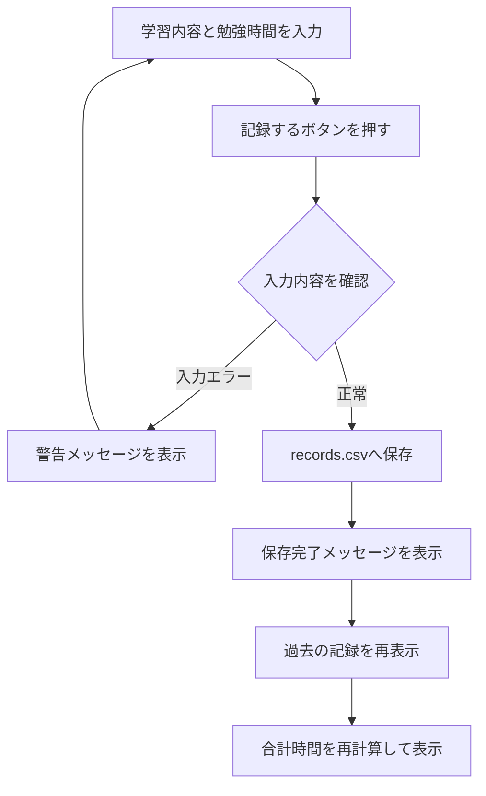
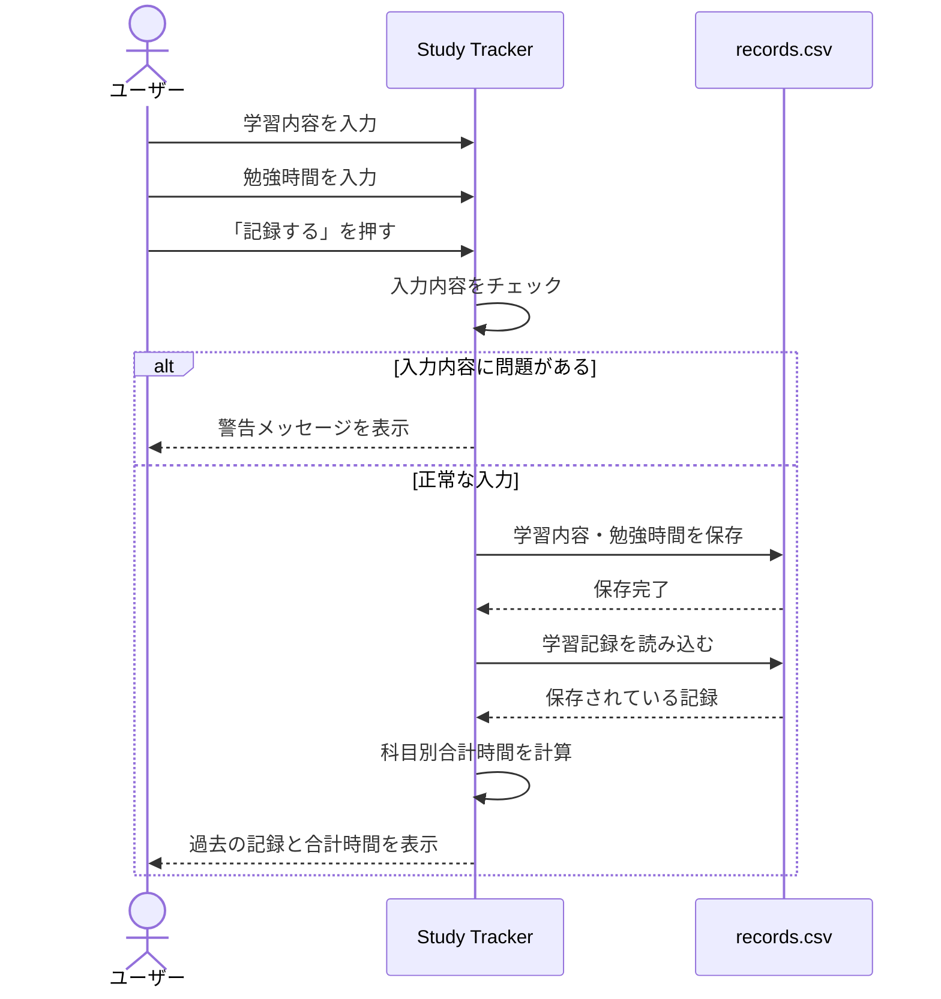
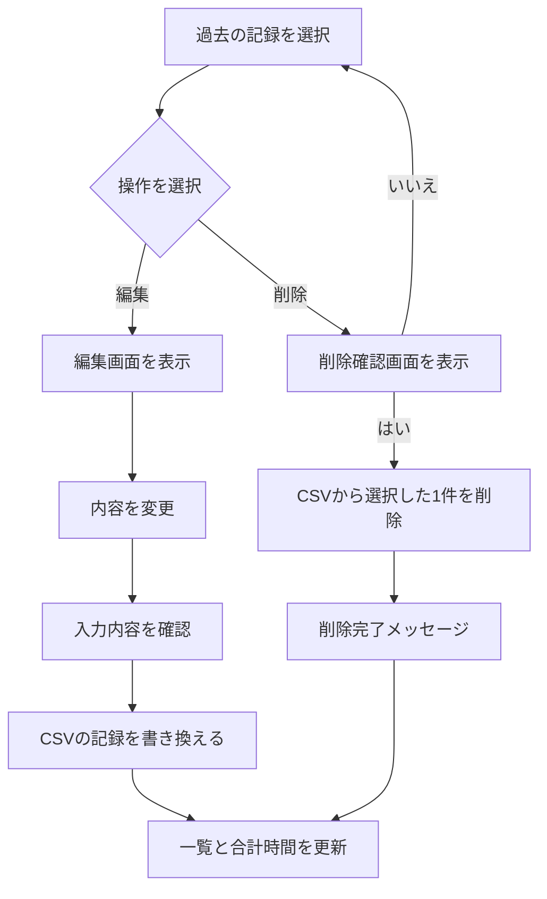

# Study Tracker 仕様書

## 1. アプリ概要

Study Trackerは、学習した内容と勉強時間を記録・管理するためのPythonアプリです。

大学の勉強、資格勉強、読書、プログラミング、自主学習など、分野を問わず学習している人が、
「何を・どのくらい勉強したか」を記録し、振り返ることを目的としています。

Ver.1.0では、機能をシンプルにするため、

- 学習内容
- 勉強時間（分）

の2つを記録します。

---

## 2. 作成目的

Pythonを学習する中で、文法を学ぶだけではなく、実際にアプリを作りながら理解を深めることを目的として作成しました。

最初にターミナル上で操作するCLI版を作成し、その後、より使いやすくするためにTkinterを使用してGUI版へ発展させました。

開発では生成AIも補助として活用し、提案されたコードを実際に動かしながら、各処理の意味を確認して学習しています。

---

## 3. 対象ユーザー

大学の講義、資格勉強、読書、プログラミングなど、分野を問わず自主的に学習している人を対象とします。

---

## 4. 使用技術

| 技術 | 使用目的 |
|---|---|
| Python | アプリ全体の処理 |
| Tkinter | GUI画面の作成 |
| CSV | 学習記録の保存・読み込み |
| Git | バージョン管理 |
| GitHub | ソースコードの公開・管理 |

---

## 5. ファイル構成

```text
study-tracker/
├── main.py
├── gui.py
├── records.csv
├── README.md
└── SPECIFICATION.md
---

## 6. 機能一覧

Study Trackerでは、以下の機能を実装します。

| 機能 | 内容 |
|---|---|
| 学習記録 | 学習内容と勉強時間を記録する |
| 記録表示 | 保存された学習記録を一覧表示する |
| 合計時間表示 | 学習内容ごとの合計勉強時間を表示する |
| 編集 | 選択した記録を編集する |
| 削除 | 選択した記録を削除する |
| 入力チェック | 不正な入力を防止する |

---

## 7. 学習記録機能

ユーザーは以下の2つを入力します。

- 学習内容
- 勉強時間（分）

「記録する」ボタンを押すと、入力内容を確認した後、
`records.csv` に記録を保存します。

### 入力例

```text
学習内容：Python
勉強時間：60
```

保存後は、

```text
Python：60分
```

と過去の勉強記録に表示します。

---

## 8. 入力ルール

### 学習内容

学習内容が空欄の場合は保存しません。

また、入力された文字の前後に空白がある場合は削除します。

例：

```text
"  Python  "
```

↓

```text
"Python"
```

### 勉強時間

勉強時間は1分以上の整数とします。

以下の入力は保存できません。

```text
0
-10
abc
```

入力内容に問題がある場合は、警告メッセージを表示します。

---

## 9. 過去の記録表示

保存された記録を一覧で表示します。

例：

```text
読書：30分
英語：45分
Python：60分
```

新しく登録された記録を上に表示します。

記録が存在しない場合は、

```text
まだ記録がありません。
```

と表示します。

---

## 10. 科目別合計時間

同じ学習内容について、記録された勉強時間を合計します。

例えば、

```text
Python：60分
Python：30分
```

と記録した場合、

```text
Python：90分
```

と表示します。

また、

```text
Python
python
PYTHON
```

のように大文字・小文字だけが異なる場合は、
同じ学習内容として集計します。

勉強時間はすべて「分」で表示します。

---

## 11. 編集機能

過去の学習記録から編集したい記録を選択し、
「編集」ボタンを押します。

編集専用画面を表示し、

- 学習内容
- 勉強時間

を変更できるようにします。

編集後は `records.csv` の該当する記録を書き換えます。

編集が完了すると、

```text
記録を更新しました。
```

と表示し、過去の記録と合計時間を再表示します。

記録が選択されていない場合は、

```text
編集する記録を選択してください。
```

と警告を表示します。

---

## 12. 削除機能

過去の学習記録から削除したい記録を選択し、
「削除」ボタンを押します。

削除する前に、

```text
この記録を削除しますか？
```

という確認画面を表示します。

「はい」を選択した場合のみ、
`records.csv` から選択した記録を削除します。

削除後は、

```text
記録を削除しました。
```

と表示し、過去の記録と合計時間を再表示します。

記録が選択されていない場合は、

```text
削除する記録を選択してください。
```

と警告を表示します。

同じ内容の記録が複数存在する場合でも、
選択した1件だけを削除します。

---

## 13. データ保存

学習記録は `records.csv` に保存します。

保存形式は以下のようになります。

```csv
Python,60
英語,30
読書,45
```

Ver.1.0では、学習日時は保存しません。

記録するデータは、

- 学習内容
- 勉強時間

の2つとします。

---

## 14. 画面構成

GUI版では、以下のような画面構成とします。

```text
--------------------------------

        Study Tracker

学習内容
[                    ]

勉強時間（分）
[                    ]

       [ 記録する ]

過去の勉強記録

Python：60分
英語：30分
読書：45分

     [ 編集 ] [ 削除 ]

科目別 合計勉強時間

Python：120分
英語：30分
読書：45分

--------------------------------
```

---

## 15. 記録処理の流れ

ユーザーが学習記録を保存するときの処理は、
以下の流れになります。



---

## 16. シーケンス図

学習記録を保存するときの、
ユーザー・GUI・CSVファイル間の処理の流れを示します。



---

## 17. 編集・削除処理の流れ



---

## 18. 現在のアプリの範囲

Ver.1.0は、Tkinterを使用したローカルPC向けの
デスクトップアプリとして作成しています。

GitHubではソースコードを公開していますが、
現在はブラウザ上で利用するWebアプリではありません。

まずはPythonを使用して、

- データを入力する
- データを保存する
- データを読み込む
- データを集計する
- GUIから操作する

という基本的な処理を実際に作ることを重視しました。

---

## 19. 今後追加したい機能

PythonやWeb開発についてさらに学習しながら、
今後は以下の機能を追加したいと考えています。

- 学習日時の記録
- 勉強時間のグラフ表示
- Webアプリ化
- データベースを利用した記録管理
- 複数ユーザーへの対応

---

## 20. 開発を通して学んだこと

今回の開発では、Pythonの文法を学ぶだけではなく、
実際にアプリを作成することで、

- 関数
- 条件分岐
- 繰り返し処理
- リスト・辞書
- CSVファイルの読み書き
- TkinterによるGUI作成
- 入力値のチェック
- Git / GitHubによるバージョン管理

などを実際に使用しました。

また、最初にCLI版を作成し、その後GUI版へ発展させることで、
少しずつ機能を追加しながらアプリを改善する経験ができました。

開発では生成AIも補助として活用しています。
提案されたコードをそのまま完成とするのではなく、
実際に動作させながら処理の意味を確認し、
分からない部分を調べることで理解を深めています。