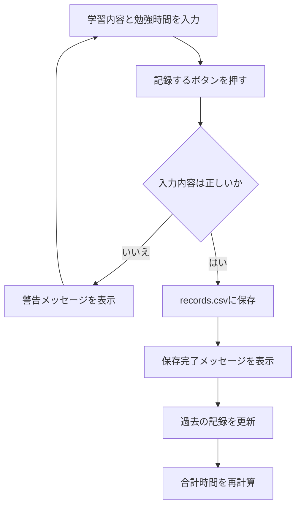
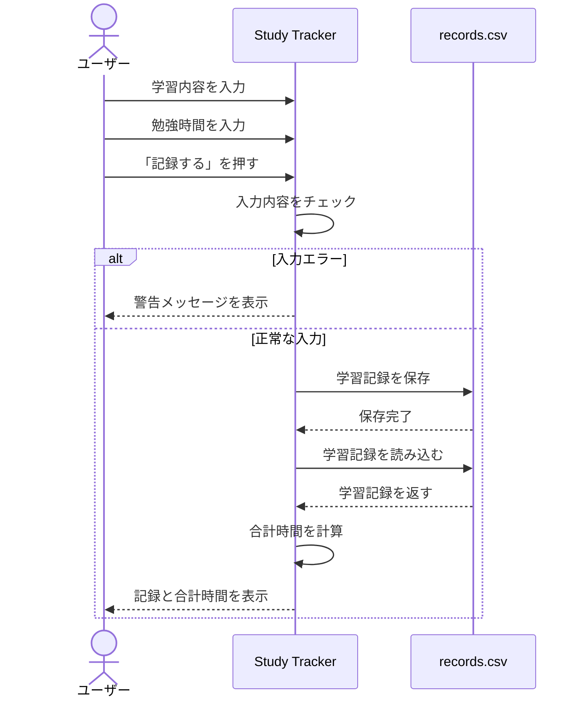

# Study Tracker 仕様書

## 1. 機能一覧

Study Trackerは、学習内容と勉強時間を記録・管理するアプリです。

| 機能 | 内容 |
|---|---|
| 学習記録 | 学習内容と勉強時間を記録する |
| 記録表示 | 保存された学習記録を一覧表示する |
| 合計時間表示 | 学習内容ごとの合計勉強時間を表示する |
| 編集 | 選択した記録の内容を変更する |
| 削除 | 選択した記録を削除する |
| 入力チェック | 不正な入力が保存されることを防ぐ |

---

## 2. 入力仕様

### 2.1 学習内容

学習内容を文字列で入力します。

入力例：

```text
Python
英語
読書
TOEIC
```

以下のルールで処理します。

- 空欄の場合は保存しない
- 前後の余分な空白は削除する
- 大文字・小文字が異なる場合でも、合計時間の集計では同じ学習内容として扱う

例：

```text
Python
python
PYTHON
```

上記は合計時間を計算するときに同じ学習内容として扱います。

---

### 2.2 勉強時間

勉強時間は「分」で入力します。

1分以上の整数のみ保存できます。

保存可能：

```text
30
60
120
```

保存不可：

```text
0
-30
abc
```

入力条件を満たさない場合は、警告メッセージを表示して保存処理を中止します。

---

## 3. 学習記録の保存

「記録する」ボタンを押すと、以下の順番で処理します。

1. 学習内容を取得する
2. 勉強時間を取得する
3. 入力内容をチェックする
4. 正常な場合は記録を保存する
5. 保存完了メッセージを表示する
6. 入力欄を空にする
7. 過去の記録を再表示する
8. 合計時間を再計算する

保存するデータは以下の2項目です。

```text
学習内容
勉強時間（分）
```

---

## 4. データ保存仕様

学習記録は `records.csv` に保存します。

保存例：

```csv
Python,60
英語,30
読書,45
```

Ver.1.0では学習日時は保存しません。

---

## 5. 過去の記録表示

保存された学習記録を一覧表示します。

例：

```text
読書：45分
英語：30分
Python：60分
```

新しく登録した記録を上に表示します。

記録が存在しない場合は、

```text
まだ記録がありません。
```

と表示します。

---

## 6. 合計時間表示

同じ学習内容の勉強時間を合計して表示します。

例えば、

```text
Python：60分
Python：30分
```

という2件の記録が存在する場合、

```text
Python：90分
```

と表示します。

大文字・小文字だけが異なる場合も同じ学習内容として集計します。

例：

```text
Python：60分
python：30分
PYTHON：10分
```

↓

```text
Python：100分
```

合計時間はすべて「分」で表示します。

---

## 7. 編集機能

過去の記録から編集したい記録を1件選択し、「編集」ボタンを押します。

編集ボタンを押すと、編集専用画面を表示します。

編集画面では、

- 学習内容
- 勉強時間

を変更できます。

編集時にも、新規登録と同じ入力チェックを行います。

正常に更新された場合は保存データを書き換え、

```text
記録を更新しました。
```

と表示します。

その後、過去の記録と合計時間を再表示します。

記録を選択していない場合は、

```text
編集する記録を選択してください。
```

と警告を表示します。

---

## 8. 削除機能

過去の記録から削除したい記録を1件選択し、「削除」ボタンを押します。

削除前に、

```text
この記録を削除しますか？
```

という確認画面を表示します。

「はい」を選択した場合のみ、選択された記録を保存データから削除します。

削除完了後、

```text
記録を削除しました。
```

と表示します。

その後、過去の記録と合計時間を再表示します。

「いいえ」を選択した場合は削除しません。

記録を選択していない場合は、

```text
削除する記録を選択してください。
```

と警告を表示します。

同じ内容の記録が複数存在する場合でも、選択した1件だけを削除します。

---

## 9. 画面仕様

メイン画面には以下の項目を表示します。

```text
--------------------------------

          Study Tracker

学習内容
[                     ]

勉強時間（分）
[                     ]

        [ 記録する ]

過去の勉強記録

Python：60分
英語：30分
読書：45分

      [ 編集 ] [ 削除 ]

科目別 合計勉強時間

Python：120分
英語：30分
読書：45分

--------------------------------
```

編集ボタンを押した場合は、編集専用の別ウィンドウを表示します。

```text
------------------------

        記録を編集

学習内容
[ Python            ]

勉強時間（分）
[ 60                ]

          [ 保存 ]

------------------------
```

---

## 10. 記録処理フロー



---

## 11. シーケンス図

学習記録を保存するときの処理の流れを示します。



---

## 12. 編集・削除処理フロー

```mermaid
flowchart TD

A[過去の記録を選択]
B{操作}

A --> B

B -- 編集 --> C[編集画面を表示]
C --> D[内容を変更]
D --> E[入力内容をチェック]
E --> F[選択した記録を書き換える]
F --> G[記録と合計時間を更新]

B -- 削除 --> H[削除確認]
H -- いいえ --> A
H -- はい --> I[選択した1件を削除]
I --> J[削除完了メッセージ]
J --> G
